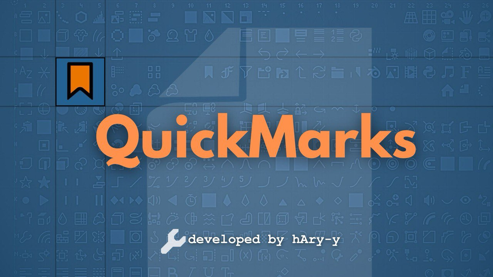

- 

# QuickMarks Addon for Blender

## Overview
QuickMarks is a Blender addon that allows users to save and manage web bookmarks and modifier groups within the 3D Viewport. It provides quick access to favorite websites, modifier stacks, and a Google search feature, with a dedicated delete mode toggle.

## Installation
1. Download the addon ZIP file from [GitHub](https://github.com/hAry-y/QuickMarks).
2. In Blender, go to `Edit > Preferences > Add-ons`.
3. Click `Install from Disk` and select the ZIP file.
4. Enable "QuickMarks" by checking the box.

## Features
- **Search Panel**: Quick access to Google search and Blender.org.
- **Bookmarks Panel**: Save and open custom web bookmarks.
- **Modifier Groups Panel**: Save and apply modifier stacks to objects.
- **Delete Mode Panel**: Toggle to enable deletion of bookmarks or modifier groups.
- **Interface**: Located in the 3D Viewport Sidebar under the "QuickMarks" tab.

## Usage
1. **Access**:
   - Open the 3D Viewport Sidebar (`N` key) and find the "QuickMarks" tab.
2. **Search Panel**:
   - Click "Google!" to enter a search query that opens in your browser.
   - Click "blender.org" to visit the Blender website.
3. **Bookmarks Panel**:
   - Click `+Bookmark` to add a name and URL.
   - Click a bookmark to open it in your browser.
   - Enable "Enable Delete Mode" to remove bookmarks by clicking.
4. **Modifier Groups Panel**:
   - Select an object and click `+Modifier Group` to save its modifier stack.
   - Click a modifier group to apply it to the active object.
   - Enable "Enable Delete Mode" to delete modifier groups.
5. **Delete Mode Panel**:
   - Toggle "Enable Delete Mode" to switch to deletion mode for bookmarks and modifier groups.

## Requirements
- Blender 3.0.0 or higher.

## Notes
- URLs without `http://` or `https://` default to `https://`.

## Author
Harinarayanan P V

## Support
Report issues or request features at [GitHub Issues](https://github.com/hAry-y/QuickMarks).
